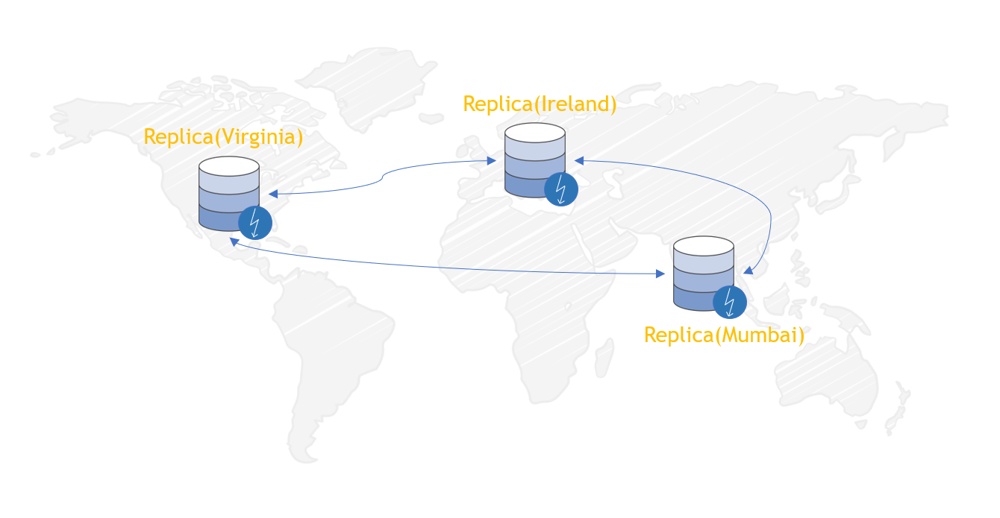

# AWS DynamoDB Global Tables: Multi Region, Multi Master Database

As a learning exercise, lets use the AWS Documentation and find out how to create Global Multi Master, Multi Region database with DynamoDB and verify latency.

A _global table_ is a collection of one or more replica tables, all owned by a single AWS account.

A _replica table_ (or replica, for short) is a single DynamoDB table that functions as a part of a global table. Each replica stores the same set of data items. Any given global table can only have one replica table per region.

The following is a conceptual overview of how a global table is created.

1. Create an ordinary DynamoDB table, with DynamoDB Streams enabled, in an AWS region.
1. Repeat step 1 for every other AWS region where you want to replicate your data.
1. Define a DynamoDB global table, based upon the tables that you have created.



## Setup The Tables

- Region 1 - Mumbai
- Region 2 - Virginia
- Region 3 - Ireland
- Log Retention Days: Defaults to 14 days

1. Create a new table (`Music`) in Mumbai, with DynamoDB Streams enabled (`NEW_AND_OLD_IMAGES`):

    ```bash
    aws dynamodb create-table \
        --table-name Music \
        --attribute-definitions \
            AttributeName=Artist,AttributeType=S \
            AttributeName=SongTitle,AttributeType=S \
        --key-schema \
            AttributeName=Artist,KeyType=HASH \
            AttributeName=SongTitle,KeyType=RANGE \
        --provisioned-throughput \
            ReadCapacityUnits=1,WriteCapacityUnits=1 \
        --stream-specification StreamEnabled=true,StreamViewType=NEW_AND_OLD_IMAGES \
        --region ap-south-1
    ```

1. Create an identical `Music` table in US East (N. Virginia):

    ```bash
    aws dynamodb create-table \
        --table-name Music \
        --attribute-definitions \
            AttributeName=Artist,AttributeType=S \
            AttributeName=SongTitle,AttributeType=S \
        --key-schema \
            AttributeName=Artist,KeyType=HASH \
            AttributeName=SongTitle,KeyType=RANGE \
        --provisioned-throughput \
            ReadCapacityUnits=1,WriteCapacityUnits=1 \
        --stream-specification StreamEnabled=true,StreamViewType=NEW_AND_OLD_IMAGES \
        --region us-east-1
    ```

1. Create a global table (`Music`) consisting of replica tables in the *ap-south-1* and *us-east-1* regions.

    ```bash
    aws dynamodb create-global-table \
        --global-table-name Music \
        --replication-group RegionName=ap-south-1 RegionName=us-east-1 \
        --region ap-south-1
    ```

1. Create another table in EU (Ireland), with the same settings as those you created in Step 1 and Step 2:

    ```bash
    aws dynamodb create-table \
        --table-name Music \
        --attribute-definitions \
            AttributeName=Artist,AttributeType=S \
            AttributeName=SongTitle,AttributeType=S \
        --key-schema \
            AttributeName=Artist,KeyType=HASH \
            AttributeName=SongTitle,KeyType=RANGE \
        --provisioned-throughput \
            ReadCapacityUnits=1,WriteCapacityUnits=1 \
        --stream-specification StreamEnabled=true,StreamViewType=NEW_AND_OLD_IMAGES \
        --region eu-west-1
    ```

    After you have done this, add this new table to the *Music* global table:

    ```bash
    aws dynamodb update-global-table \
        --global-table-name Music \
        --replica-updates 'Create={RegionName=eu-west-1}' \
        --region ap-south-1
    ```

## Verify Global Replication

1. To verify that replication is working, add a new item to the Music table in Mumbai:

    ```bash
    aws dynamodb put-item \
        --table-name Music \
        --item '{"Artist": {"S":"item_1"},"SongTitle": {"S":"Song Value 1"}}' \
        --region ap-south-1
    ```

1. Wait for a few seconds, and then check to see if the item has been successfully replicated to US East (N\. Virginia) and EU (Ireland):

    ```bash
    aws dynamodb get-item \
        --table-name Music \
        --key '{"Artist": {"S":"item_1"},"SongTitle": {"S":"Song Value 1"}}' \
        --region us-east-1
    ```

    ```bash
    aws dynamodb get-item \
        --table-name Music \
        --key '{"Artist": {"S":"item_1"},"SongTitle": {"S":"Song Value 1"}}' \
        --region eu-west-1
    ```

## Timing Your Insert/Read Queries

  Lets do some crude inserts and time their replication

    ```bash
    for i in {1..5}
     do
      val=${RANDOM}
      # Insert Items
      echo "Inserting Item:item_`${i}`"
      time aws dynamodb put-item --table-name Music --item '{"Artist": {"S":"item_'${i}'"},"SongTitle": {"S":"Song Value '${val}'"}}' --region ap-south-1
      sleep 0.25
      # Read Items
      echo "Retrieving Item:item_`${i}` after 0.25 Seconds"
      time aws dynamodb get-item --table-name Music --key '{"Artist": {"S":"item_'${i}'"},"SongTitle": {"S":"Song Value '${val}'"}}' --region eu-west-1
     done
    ```
  
## Contact Us

You can reach out to us to get more details through [here](https://youtube.com/c/valaxytechnologies/about).

##### References

1. [AWS Docs](https://docs.aws.amazon.com/amazondynamodb/latest/developerguide/globaltables.tutorial.html)